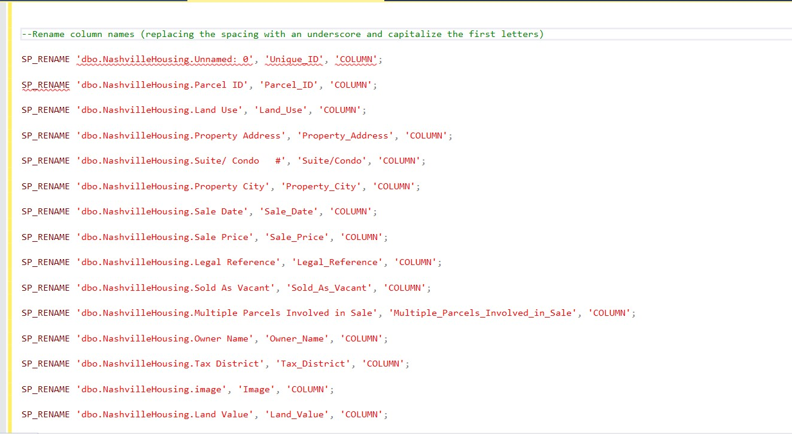

# Data Cleaning in SQL
This is a documented personal project on Data cleaning with SQL and all the process are explained therein.

## Introduction
Data cleaning is a crucial process in any data analytics project, as it ensures that the data used for analysis is accurate, complete, and consistent. SQL is a powerful query language for managing and manipulating relational databases. The project will involve identifying and addressing errors, inconsistencies, and missing values in the dataset, as well as optimizing the data structure for improved analysis. By the end of this project, I aim to have a clean and reliable dataset ready for further analysis and insights.

In this project, I used the Microsoft SQL Server in cleaning the dataset.
                                                      

The full query for this project can be found [here]()
                                                      

### Data Sourcing

The dataset that I used in this project is open-source data without any PII (Personally Identifiable Information) that I acquired from [Kaggle](https://www.kaggle.com/datasets/tmthyjames/nashville-housing-data?resource=download). The dataset includes information of real estate data from the hot Nashville housing market.
There are more than 56600 rows on this dataset and 30 columns that are titled: Unnamed, Parcel ID, Land Use, Property Address, Suite/ Condo #, Property City, Sale Date, Sale Price, Legal Reference, Sold As Vacant, Multiple Parcels Involved in Sale, Owner Name, Address, City, State, Acreage, Tax District, Neighborhood, Image, Land Value, Building Value, Total Value, Finished Area, Foundation Type, Year Built, Exterior Wall, Grade, Bedrooms, Full Bath, Half Bath. This dataset has a lot of inconsistencies which makes this dataset perfect to practice data cleaning.

                                                     . . .

  
   Excel raw data

                                                      . . .

## Objective of the project

1. Rename Column Names
2. Standardize Sales Date column format
3. Populate Null Property Address data
4. Populate Null Property City data
5. Change abbreviations and correct misspellings in Column Land Use
6. Remove Duplicates
7. Delete Unused Columns

                                                      . . .

## Skills / Concepts Demonstrated

The following skills were demonstrated in this data cleaning project using SQL:
- SQL database: The project requires knowledge and expertise in SQL for managing and manipulating relational databases
- Data wrangling: Data cleaning requires the ability to identify and address errors, inconsistencies, and missing values in the data.
- Data analysis: The project requires knowledge of data analysis techniques to identify patterns, trends, and insights in the data.
- Data optimization: The project requires the ability to optimize the data structure for improved analysis and insights.
- Problem-solving: Data cleaning projects require problem-solving skills to identify and address issues in the data.
- Attention to detail: Data cleaning requires a keen eye for detail to ensure data accuracy and completeness.
- Communication: The project requires effective communication skills to present findings and recommendations to stakeholders.

                                                      . . .

## Procedure

Firstly, I pulled the whole dataset to view all the rows and columns. I noticed that some faults were present in the dataset such as the column names that waere not properly formated by having spacing between the words. Sale Date column which is in Date-Time format, there were many NULL values in some important parts of the dataset such as the Property Address and Property City, there were also some abreviations and misspellings which might alter the analysis should this be later used for analysis, there were duplicate values present and also some extra columns that are not needed for further analysis.

                                                      . . .

### Rename column names (replacing the spacing with an underscore)

  
 

  
   Unformated Column Names

I noticed that the column names have spacing between them, this could still be used in a query by opening and closing it with a square bracket but it is not a standard practice of naming a column.

. . .

The spacing was replaced with an underscore and a column was re-named using the below query:

  
   Query 1

. . .

The image below shows the renamed columns to be used for further cleaning as standard practice.

  
    Formated Column Names

                                                      . . .

### Standardize the Date format (Eliminating the time constraints from the Sale Date column)

The Sale_Date column was formated with Date-Time format in this dataset but the time component is not necessary which has to be removed because the dataset is not for Time siries analysis.

The time component was removed using the query below:

  
   Query 2

. . .

This process was achieved by first altering the table adding a Sale_Date2 column and converted it by setting the date type as Date.
The below image show the existing date time column and the created date column

  
   Sale_Date2

                                                        . . .

### Populate Null Property Address Data

The Property_Address column was noticed to have so many **NULL** values and it is an important column in the dataset which shows the location of a propertty to be analysed. This has to be corrected because it will sway the outcome of the analysis should the dataset be used further for analysis.

The query below was used to populate the NULL values:

  
   Query 3

---

The below image show the NULL values in the Property_Address column:

  
   Property Address Null

From the image above, the **NULL** values are 159 in total which will have to be populatd.

The query below shows that some rows with similar Parcel ID has the same Property Address:

  
   Query 4

This relationship between the **Parcel_ID** and the **Property_Address** can be used to populate the **NULL** values in the Property Address column using a **SELF JOIN** of the table itself using the query below:

  
   Query 5

For the **JOIN** to function in the query above, I just gave the joined tables the names "a" and "b" at random. *IsNULL(where we want to look for a NULL value, what we want to populate the NULL value with)* is the syntax for this statement. The addresses where the **Parcel_ID** is common and the **Unique_IDs** don't match were filled in by the **ISNULL** query in the NULL cells. Due to the possibility that the **Parcel_IDs** for two different rows could be identical, but not the **Unique_ID**, I used the **Unique_ID** to prevent the same **Parcel_IDs** from being compared more than once.

The **ISNULL** has populated the NULL cells with the **Property_Addresses** where it has same **Parcel ID** with 18 rows. The remaining 10 rows does not have **Property_Address** populated.

I can now update the table with the below query:

